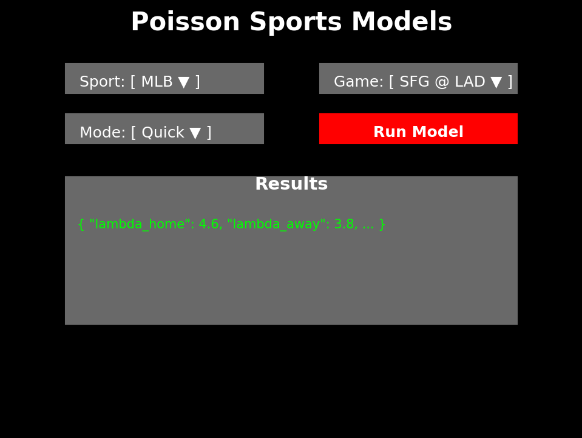

# Poisson Sports Models (MLB + NFL)

This project provides **Poisson-based totals modeling** for MLB and NFL games with a modern frontend.
It is fully deployable to **Netlify** (frontend + backend functions).

---

## ⚙️ Features
- **MLB & NFL engines** in Python (`poisson_models.py`)
- **Serverless function** (`netlify/functions/poisson.py`) exposing the model
- **React + Tailwind frontend** (`src/App.jsx`) with API-driven dropdowns
- **Netlify-ready** via `netlify.toml`

---

## 🚀 Getting Started

### 1. Install Dependencies
```bash
npm install
```

### 2. Run Locally (frontend only)
```bash
npm run dev
```
Frontend runs at `http://localhost:5173`.

> ⚠️ The backend runs in Netlify Functions. For local API testing, use the Netlify CLI:
```bash
npm install -g netlify-cli
netlify dev
```

---

## 📦 Project Structure

```
poisson_netlify/
├── poisson_models.py            # Full MLB + NFL Poisson models with dispatcher
├── netlify/
│   └── functions/
│       └── poisson.py           # Serverless wrapper around models
├── src/
│   └── App.jsx                  # React frontend
├── package.json                 # React + Tailwind + Vite config
├── netlify.toml                 # Netlify build/deploy config
```

---

## 🌐 Deployment on Netlify

1. Push this project to GitHub/GitLab/Bitbucket.
2. Go to [Netlify](https://app.netlify.com/) → **New Site from Git**.
3. Connect your repo.
4. Netlify will detect `npm run build` and publish `dist/`.
5. Functions are served from `/.netlify/functions/poisson`.

---

## 🔄 Workflow

1. User selects **Sport (MLB/NFL)** → dropdown auto-fills **today’s matchups** via APIs:
   - MLB: [StatsAPI](https://statsapi.mlb.com)
   - NFL: [ESPN Scoreboard](https://site.api.espn.com/apis/v2/sports/football/nfl/scoreboard)
2. User selects **Mode** (`quick` or `glm`).
3. Frontend sends request → Netlify Function → `poisson_models.py`.
4. Backend computes **λ_home, λ_away, λ_total**, fair odds, totals distribution.
5. Results displayed in frontend console view.

---


---

## 🖼️ UI Preview



## ⚠️ Disclaimer
This tool is for **informational and educational purposes only**.  
It is **not financial advice**. Probabilities are estimates and can be wrong.

---

Enjoy! 🎯
